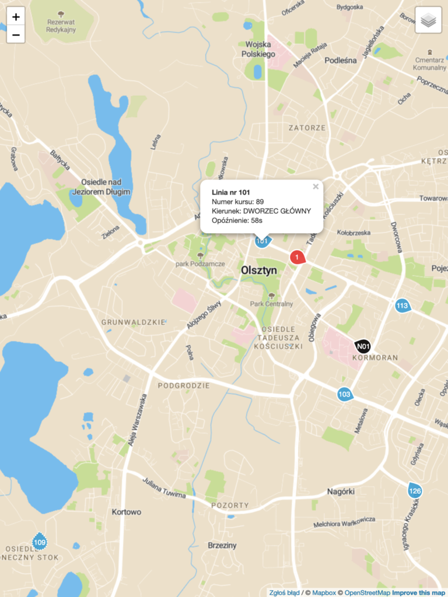

# Olsztyńskie Autobusy
<!-- Infrastructure to pull, retain and represent real-time data collected from Olsztyn public transportation vehicles -->
## About
Olsztyńskie Autobusy combine harvesting vehicles data from systems of Olsztyn public transportation agency, serving current data for web app users and retaining that data.

[](https://autobusy.olsztyn.pl)

It has modular microservice architecture divided into front/back-end.
Main part of this infrastructure is the _dataharvester_ service and a Postgres instance.

## Build & Run
In order to start a dockerized instance locally, you need to obtain session cookie and build services from source.
This walk-through assumes you have Go & Docker installed and configured.

Clone repository:
```
git clone git@github.com:amwolff/oa.git $GOPATH/src/github.com/amwolff/oa
```

Install dependencies:
```
curl https://raw.githubusercontent.com/golang/dep/master/install.sh | sh
cd $GOPATH/src/github.com/amwolff/oa
dep ensure
```

Get session cookie:
1. In browser navigate to `sip.zdzit.olsztyn.eu`;
2. Open up inspector (Google Chrome: Control+Shift+I) > Application > Storage > Cookies;
3. Copy value of ASP.NET_SessionId cookie.

Configure services:

In files
```
# $GOPATH/src/github.com/amwolff/oa/deploy/services/dataharvester/example_config.yml
Line 3: ClientCookie: <your-ClientCookie>
# $GOPATH/src/github.com/amwolff/oa/deploy/services/pinger/Dockerfile
Line 3: ENV CLIENT_COOKIE <your-ClientCookie>
```
substitue `<your-ClientCookie>` for copied value of your session cookie.

Build everything:
```
cd $GOPATH/src/github.com/amwolff/oa/deploy
./build_all.sh -d -v 63d0d1c
```

Start services:
```
docker network create backend
docker network create frontend
docker run -d --name oa_db --network backend --network-alias oa-postgres-ip-alias --rm amwolff/oa:oadb_63d0d1c
docker run -d --name oa_pinger --network backend --rm amwolff/oa:pinger_63d0d1c
docker run -d --name oa_dataharvester --network backend --rm amwolff/oa:dataharvester_63d0d1c
docker run -d --name oa_api --network backend -p 8080:80 --rm amwolff/oa:api_63d0d1c
docker network connect frontend oa_api
docker run -d --name oa_dirserver --network frontend -p 80:80 --rm amwolff/oa:dirserver_63d0d1c
```

The app should be now available at `http://localhost`.

### Notes
Started instance is very similar to what I deployed in cloud for "production" use.
Additionally, I've used docker-compose along with Docker in swarm mode (to encapsulate startup instructions) and traefik (for requests routing).

#### CI
[](https://travis-ci.com/amwolff/oa)
